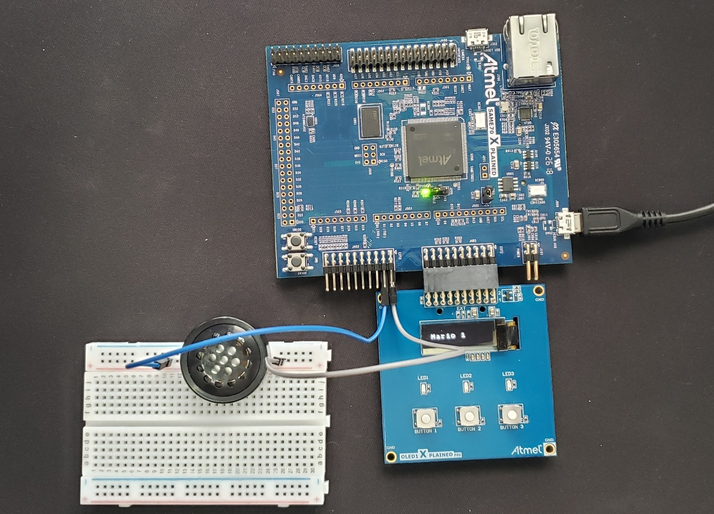

# APS 1 - Musical

## Projeto da disciplina de Computação Embarcada do Insper

Alunos:

- Bruno Domingues
- Thomas Queiroz

Realizado com o auxílio de:

- Rafael Corsi (professor)
- Eduardo Marossi (professor)
- Marco Alves (técnico)

### Proposta

O projeto tem como proposta o desenvolvimento de um sistema capaz de reproduzir músicas com o uso de um Buzzer. Além da reprodução, o sistema permite o usuário pausar a música e, caso deseje, trocar a música (três músicas disponíveis).

### Materiais

O projeto faz uso de um kit que consiste em:

- dois jumpers macho-fêmea;
- uma protoboard;
- um buzzer;
- um microcontrolador SAME70-Xplained;
- uma placa OLED1-Xplained.

### Ligações elétricas

- **Placa OLED:** conectada nos pinos EXT1
- **Negativo do Buzzer:** GND da direita dos pinos EXT2
- **Positivo do Buzzer:** pino PC13 nos pinos EXT2

### O que o código faz

O código implementa o reconhecimento (por parte do microcontrolador) do apertar de um botão, e, com o uso de interrupts e callbacks, decide o que deve ser feito de acordo com o botão que foi apertado. 

Um exemplo interessante é o botão play/pause, que, ao detectar que foi apertado, inverte uma variável que controla o estado atual da música (1 = música parada, 0 = música tocando), o que por sua vez faz o buzzer parar de tocar ou voltar. Para reconhecer o botão utiliza-se funções que configuram o PIO envolvido no processo (dado que o mesmo foi identificado corretamente) como um input. 

Por fim, para tocar a música, configurou-se o buzzer como output, e foi feita uma função que recebe a frequência de uma nota e sua duração, que por sua vez reproduz a nota utilizando um sinal de output similar a um PWM. Além do buzzer também configurou-se o LED do SAME70 para piscar junto ao ritmo da música.

### Funcionalidade

- **Botão 1:** função play/pause
- **Botão 2:** função previous (música anterior)
- **Botão 3:** função next (próxima música)

- **LED verde:** pisca no ritmo da música

- **Display:** mostra o nome da música atual

### Vídeo do projeto funcionando

### Créditos das músicas
[Super Mario](https://www.hackster.io/jrance/super-mario-theme-song-w-piezo-buzzer-and-arduino-1cc2e4)

[Take on Me](https://create.arduino.cc/projecthub/GeneralSpud/passive-buzzer-song-take-on-me-by-a-ha-0f04a8)